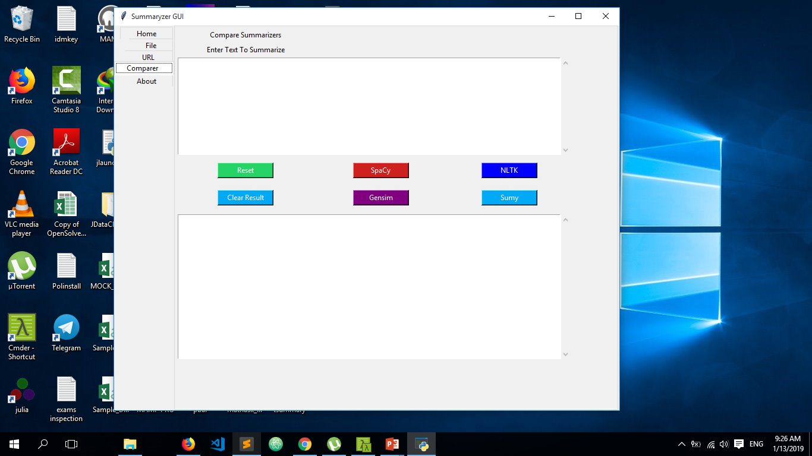
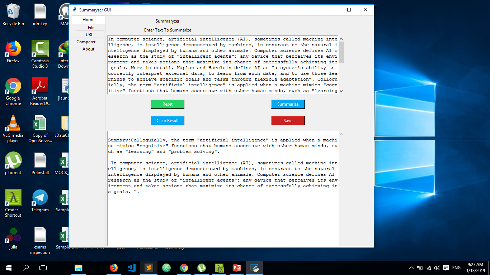
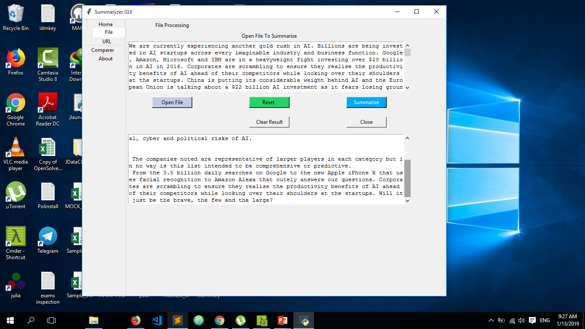
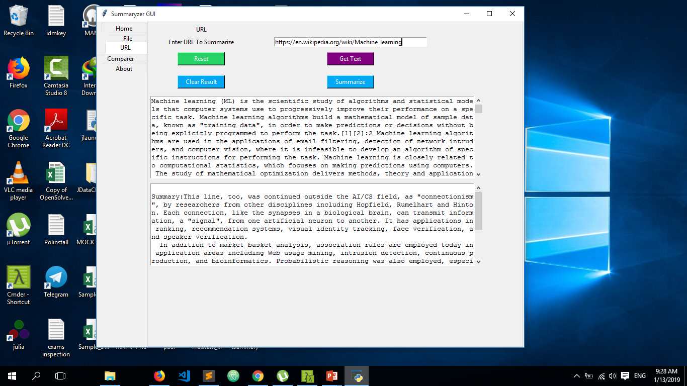
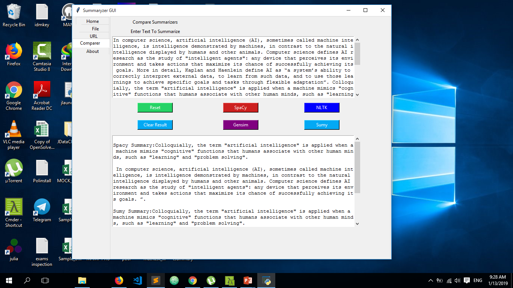

### Natural Language Processing Apps
 - Graphical User Interface Apps

#### Summaryzer GUI
+ Summaryzer_GUI : simply text/ document summarization gui with python tkinter
	- Using Spacy,Sumy,Gensim and NLTK
	- Fetch text from url and summarize
	- Summarize files as well as links
	- Compare various summarizers

##### Requirements
- Python 3
- Spacy
- NLTK
- Gensim
- Sumy

##### Screenshot

##### Simple Summary

##### Works with file(txt)

##### Fetch Url and Summarize

##### Compare Summarizers

##### To Do
+ Building a executable for windows and unix based systems

##### .
- By Jesse E. Agbe (JCharis)
- Jesus Saves @JCharisTech
- J-Secur1ty

